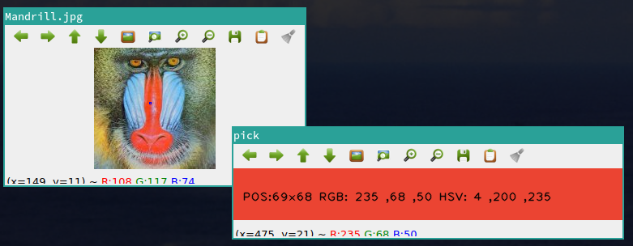
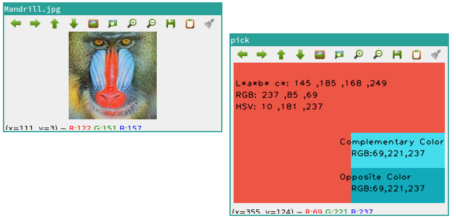

# Color picker

## Features
Simple & Portable ColorPicker.

## required
python

## Usage
python color_picker.py imgfile

| command                | description|
|:-------------------|:--------------------------------------------------------|
| `Mouse LBUTTON` | Display the color of a single point.(RGB&HSV)  |
| `SHIFT+Mouse LBUTTON` | Display the average of the colors in the selected range. |
| `q` | Close child window. |
| `Esc` | Terminated. |

