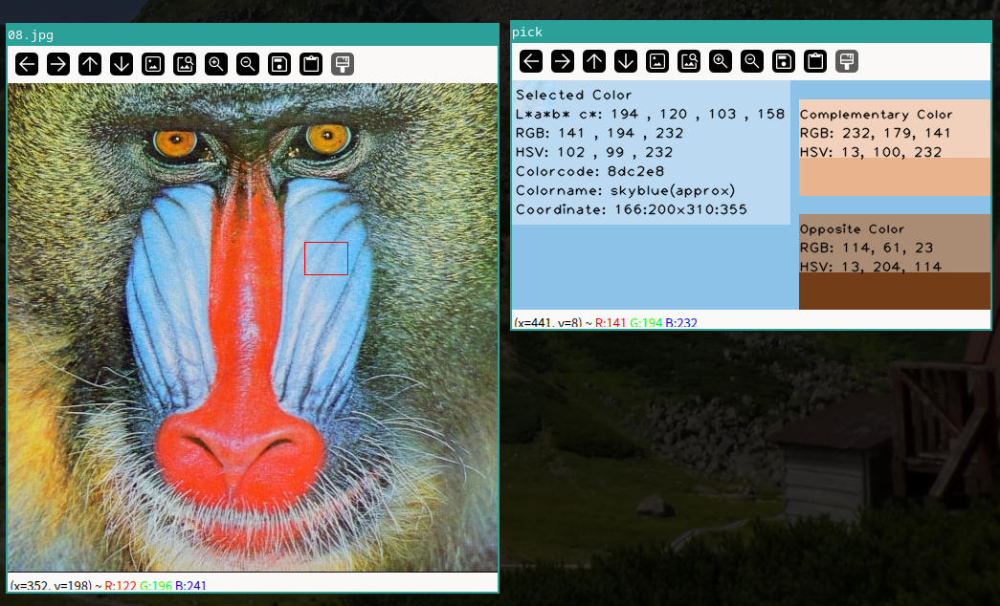

# Color Picker

This Python application allows users to interactively pick a color from an image and display various information about the selected color, such as its RGB, HSV, and L\*a\*b\* values, as well as the complementary and opposite colors. The program is built using OpenCV, NumPy, and other Python libraries.

## Features

- Select a region of an image using the mouse.
- Calculate and display the average RGB, HSV, and L\*a\*b\* values of the selected region.
- Identify the closest named color from the CSS4 color names.
- Display the complementary and opposite colors for the selected region.
- Visualize the picked color, complementary color, and opposite color with additional color information.

## Requirements

- Python 3.x
- OpenCV (`cv2`)
- NumPy
- Pillow (PIL)
- Matplotlib
- SciPy

## Installation

1. Clone the repository:

    ```bash
    git clone https://github.com/hirocarma/ColorPicker.git
    cd ColorPicker
    ```

2. Install the required Python packages:

    ```bash
    pip install opencv-python numpy pillow matplotlib scipy
    ```

## Usage

1. Run the script with an image file as an argument:

    ```bash
    python color_picker.py path_to_image_file
    ```

2. The image will be displayed in a window. Use the mouse to select a region of the image:

    - **Shift + Left Click + Drag**: Select a region.
    - **Shift + Left Click**: Select a point.
    - **Ctrl + Left Click**: Select all regions of the image.
    - **Release the mouse button**: The program will calculate and display information about the selected color region.

3. To close the program:

    - Press the **"q"** key to close the "pick" window.
    - Press the **Esc** key to exit the program entirely.

## Example

```bash
python color_picker.py example.jpg
```

- Select a region using Shift + Left Click and Drag.
- The selected color's details will be displayed in a new window.


## Functions Overview
- rgb_to_name(rgb): Convert RGB values to the closest CSS4 color name.

- draw_text(image, text, position, font_scale=1, color=(0, 0, 0), thickness=1): Draw text on an image.

- calculate_average_color(image, color_space): Calculate the average color of a given image in the specified color space.

- get_color_info_text(L_ast, a_ast, b_ast, c_ast, r, g, b, h, s, v, color_name, iy, y, ix, x): Generate color information text.

- calculate_complementary_and_opposite(r, g, b): Calculate the complementary and opposite RGB colors.

- recimg_overlay(image, pt1, pt2, color=(255, 255, 255), alpha=0.4): Overlay a semi-transparent rectangle on an image.

- show_pick_window(rec_img, x, y): Display a window with color information for a selected image region.

- printColor(event, x, y, flags, param): Handle mouse events and display color information.

## License
This project is licensed under the MIT License - see the LICENSE file for details.
