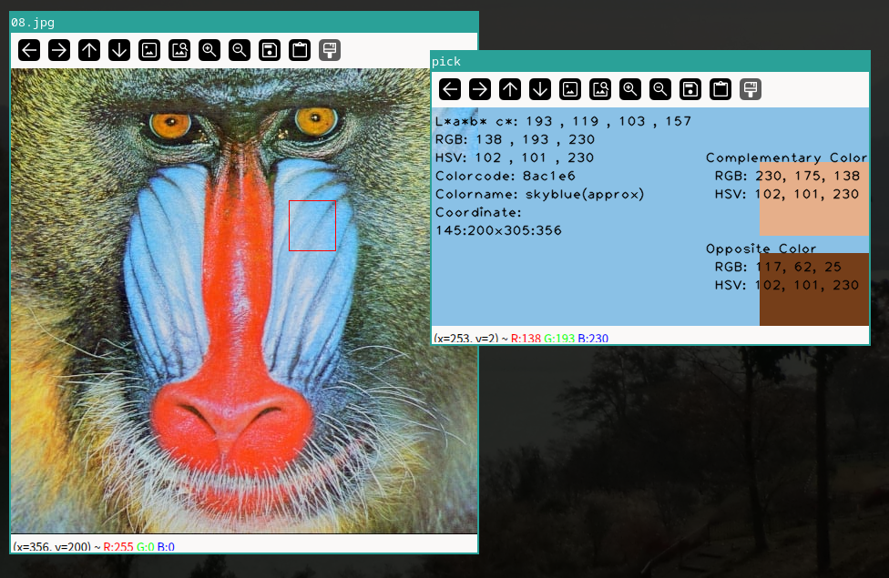

# Color picker

## Features
Simple & Portable ColorPicker.
Hold down the Shift key and drag to output the information of the selected area.  

Output: L* a* b* (&c*) , RGB , HSV , Complementary Color (& RGB),Opposite Color (&RGB)

## required
python

## Usage
python color_picker.py imgfile

| command                | description|
|:-------------------|:--------------------------------------------------------|
| `SHIFT+Mouse LBUTTON` | Display the average of the color information in the selected range. |
| `q` | Close child window. |
| `Esc` | Terminated. |

